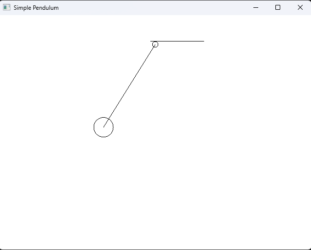
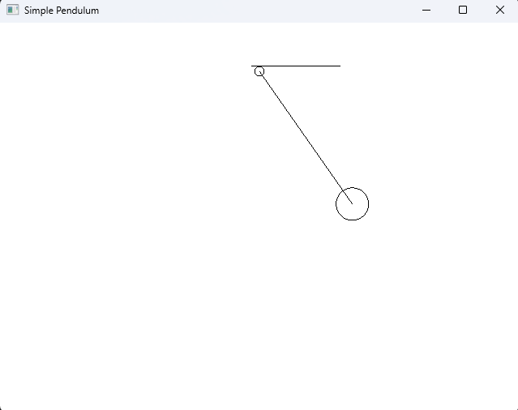

# 🎯 Simple Pendulum Animation using OpenGL

<div align="center">


A graphical simulation of a simple pendulum using OpenGL and GLUT with smooth rhythmic animation.

</div>

---

# 📌 Project Overview

This project demonstrates the simulation of a **Simple Pendulum** using **Computer Graphics concepts** in **OpenGL (GLUT)**.

The pendulum swings continuously between two extreme positions (A and B), representing rhythmic oscillatory motion. The project was developed as part of a **Computer Graphics Lab Assignment**.

---

# ✨ Features

✅ Rhythmic pendulum animation  
✅ Fixed suspension point  
✅ Circular pendulum bob  
✅ Real-time motion using GLUT Timer  
✅ Clean OpenGL rendering  
✅ Lightweight and efficient implementation  

---

# 🛠️ Technologies Used

| Technology | Purpose |
|---|---|
| C++ | Programming Language |
| OpenGL | Graphics Rendering |
| GLUT | Window & Animation Management |

---

# 📂 Project Structure

```bash
simple-pendulum-opengl/
│
├── main.cpp
├── README.md
├── LICENSE
│
└── screenshots/
    ├── position_A.png
    ├── middle.png
    └── position_B.png
```

---

# ⚙️ How the Program Works

The pendulum motion is created using:

- Trigonometric functions (`sin`, `cos`)
- Angular motion updates
- GLUT Timer Function
- OpenGL primitive drawing

The bob position is calculated dynamically using:

```cpp
bx = cx + length * sin(angle)
by = cy - length * cos(angle)
```

The angle continuously changes to create oscillatory movement.

---

# 🧠 Core Concepts Used

- Computer Graphics
- OpenGL Rendering
- Animation
- Trigonometry
- Coordinate System
- Event-driven Programming

---

# 🚀 Compilation & Execution

## Compile

```bash
g++ main.cpp -o pendulum -lglut -lGLU -lGL
```

## Run

```bash
./pendulum
```

---

# 📸 Output Screenshots

## 🔹 Left Position



---

## 🔹 Middle Position


---

## 🔹 Right Position



---

# 📖 Learning Outcomes

Through this project, the following concepts were practiced:

- OpenGL graphics programming
- Animation techniques
- Real-time rendering
- Basic physics simulation
- Use of GLUT callback functions

---

# 👨‍💻 Author

### Md Tausif Uddin

Computer Science & Engineering (CSE)  
University of Asia Pacific (UAP)

GitHub: https://github.com/tausif112

---

# 📜 License

This project is licensed under the MIT License.

---

# ⭐ Acknowledgement

This project was developed for academic and learning purposes as part of the Computer Graphics laboratory coursework.
